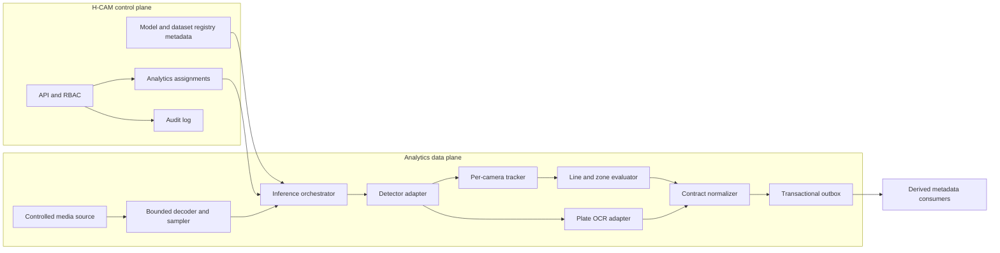

# AI Analytics Architecture

## Architectural Rule

Phase 3 separates the analytics control plane from the media-processing data
plane. API requests configure work; they never synchronously decode streams or
run heavyweight inference.



## Control Plane Responsibilities

- department-scoped analytics assignments for a stream;
- approved capability, model version, pipeline version, and configuration;
- zones, lines, schedules, minimum confidence, and review policy;
- model/dataset metadata and promotion state, not arbitrary model uploads;
- worker health, assignment status, benchmark evidence, and audit records;
- optimistic locking and reason-required mutations following existing H-CAM
  patterns.

The API must reject assignments when a stream, model, runtime, policy, or
authorization gate is missing. Configuration changes create immutable history
and an outbox event.

## Data Plane Responsibilities

1. Resolve an approved internal media path without placing credentials in
   configuration, events, logs, or process arguments.
2. Decode in a bounded worker with restricted filesystem, memory, CPU/GPU,
   network egress, and restart policy.
3. Sample frames according to the assignment and current capacity budget.
4. Apply declared preprocessing and immutable model artifacts.
5. Normalize outputs before any downstream consumer sees runtime-specific data.
6. Track objects only inside one stream and one tracker epoch.
7. Evaluate deterministic spatial and temporal primitives.
8. Emit metadata through a durable outbox with at-least-once semantics.
9. Drop or degrade work according to explicit policy rather than allowing
   unbounded queues.

## Processing Graph

The runtime executes a versioned directed acyclic graph. A minimum graph is:

```text
decode -> timestamp -> sample -> preprocess -> detect -> track
       -> optional plate crop/OCR -> line/zone rules -> normalize -> outbox
```

Every graph run is identified by `pipeline_id` and immutable
`pipeline_version`. Nodes declare input/output schemas, model references,
resource limits, timeout, and failure policy. A change to preprocessing,
postprocessing, class mapping, threshold, tracker settings, or rule semantics
creates a new pipeline version even when model weights are unchanged.

## Time Model

Three times must remain distinct:

- `observed_at`: media presentation time or the best available source time;
- `processed_at`: time the analytics node completed the observation;
- `received_at`: time the platform accepted the event.

The data plane records clock source, clock confidence, frame sequence, and
pipeline latency. It must not manufacture source precision. Ordering is only
guaranteed within a stream partition when source sequence data is available.

## State And Identity

- `track_id` is unique only within `stream_id + tracker_epoch`.
- Tracker state is ephemeral and may reset after restart, discontinuity, or
  configuration change.
- A track is not a person, vehicle identity, or cross-camera entity.
- Plate OCR text is a probabilistic observation and must retain alternatives,
  confidence, normalization method, and review state.

## Storage Boundaries

| Data | Default Phase 3 handling |
| --- | --- |
| Raw frames and video | Process in memory; no persistence by default |
| Crops or snapshots | Disabled; separate evidence authorization required |
| Observations and local tracks | Bounded derived metadata store |
| Analytic events | Durable metadata and outbox delivery |
| Model artifacts | Immutable artifact store with hash and signature |
| Datasets | Restricted data store, never Git |
| Metrics | Low-cardinality operational aggregates |
| Audit | Immutable actor, action, reason, target, and result metadata |

Exact retention periods are a policy gate and must be configured by data class.

## Failure And Degradation States

Each assignment exposes one of:

- `pending`: accepted but not yet placed;
- `starting`: loading pipeline and artifacts;
- `running`: meeting declared operating policy;
- `degraded`: reduced sampling or optional capability disabled;
- `paused`: intentionally stopped by policy or operator;
- `blocked`: authorization, artifact, configuration, or security gate failed;
- `failed`: runtime stopped after bounded recovery attempts.

Under overload, the order of response is: shed optional models, reduce sampling
within the approved floor, skip stale frames, pause the assignment, and report
degradation. The system must never silently accumulate unbounded video latency.

## Deployment Shapes

- **Developer:** one synthetic stream, CPU reference runtime, local metadata,
  no external network requirement.
- **Lab:** 1/10/50 synthetic streams, controlled gateway, one or more declared
  CPU/GPU nodes, reproducible benchmark manifest.
- **Edge candidate:** camera-site or district node emits derived metadata and
  keeps raw media local where policy permits.
- **Central candidate:** selected authorized streams use shared inference
  capacity with strict admission control.
- **Hybrid target:** registry and policy remain centralized while workloads are
  placed according to bandwidth, latency, data residency, and hardware.

The statewide target is a capacity architecture problem. Phase 3 must model
sharding, placement, and aggregate event volume, but it must not claim an
80,000-camera validation from a 50-stream lab.

## Interfaces To Preserve

- Existing camera and stream IDs remain authoritative.
- Phase 2 health determines whether analytics should start or degrade.
- Existing department scoping, RBAC, audit, ETag, and reason headers extend to
  analytics configuration.
- Existing transactional outbox conventions are reused and generalized.
- Analytics consumers receive contracts, never runtime-native tensors or raw
  decoder objects.
