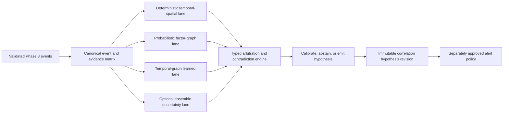

# Adaptive Multi-Engine Correlation Research

Status: planning research complete; no model, dependency, dataset, runtime, or
implementation is authorized.

## Objective

Define the innovative `D-P4.0-002:D` architecture requested by the owner. The
design must support:

- a deterministic and reproducible baseline on a CPU laptop;
- optional model-first candidate generation on suitable GPU hardware;
- richer probabilistic and ensemble evidence on larger machines or clusters;
- identical hypothesis, provenance, abstention, and human-authority contracts
  across every hardware profile;
- dynamic capability selection without silently weakening correctness or
  review requirements.

The resulting design is named **Adaptive Multi-Engine Correlation**, abbreviated
`AMEC`. The name identifies an H-CAM architecture, not a claim of a new
scientific algorithm.

## Research Findings

### Deterministic Event-Time Correlation

Apache Flink documents event-time processing, watermarks, late-event handling,
bounded pattern intervals, and explicit match skip strategies. These concepts
support a replayable correlation backbone, but this planning decision does not
select Flink as a dependency.

H-CAM implication: deterministic eligibility, event-time windows, lateness,
pattern overlap, deduplication, and resource ceilings remain explicit H-CAM
contracts regardless of the eventual execution library.

### Temporal Graph Learning

Temporal Graph Networks describe dynamic graphs as sequences of timed events
and combine graph operators with memory. This is a plausible research family
for candidate generation and ranking where relationships change over time.

H-CAM implication: a temporal-graph model may propose or rank bounded
hypothesis edges. It cannot create a durable identity, bypass a deterministic
prohibition, hide its model/data lineage, or directly create an operational
alert.

### Probabilistic Evidence Fusion

Factor graphs express a global function as local factors and support
message-passing inference. They provide a possible way to make spatial,
temporal, class, source-quality, freshness, and contradiction contributions
explicit rather than collapsing them into an unexplained score.

H-CAM implication: a versioned factor-graph lane may be evaluated against
generated evidence. Factors, priors, independence assumptions, normalization,
and conflict behavior must be explicit. It is optional and cannot turn missing
or conflicting evidence into certainty.

### Calibration, Ensembles, And Abstention

Published calibration research shows that neural-network confidence values are
not automatically reliable and evaluates post-hoc calibration such as
temperature scaling. Deep-ensemble research provides a computationally
expensive uncertainty baseline, while selective-classification research
formalizes a reject option that trades prediction coverage for lower accepted
risk.

H-CAM implication: raw logits, similarities, or model confidence are never
operator confidence. Every promoted learned lane requires held-out calibration,
reliability and risk-coverage evidence, subgroup and scenario slices, drift
limits, and an explicit abstention outcome. Resource-rich profiles may run an
ensemble; a low-resource profile may omit it and report the missing lane.

### Human Oversight

The NIST AI RMF emphasizes documented context, roles, measurement, and
human-AI oversight. It does not prescribe H-CAM's police authority model and is
not a certification.

H-CAM implication: AMEC produces evidence-bearing hypotheses. Human authority,
policy ownership, legal review, and operational activation remain separate from
model performance.

## Architecture

## Canonical Evidence Matrix

Every lane receives the same immutable, bounded representation:

- department, event, producer, stream, camera, and tracker-epoch scope;
- occurrence, observation, receipt, record, watermark, and clock confidence;
- approved geometry, topology version, direction, and travel-feasibility data;
- object class and approved non-sensitive attributes;
- model, rule, pipeline, calibration, and policy lineage;
- positive, contradicting, missing, stale, late, and degraded evidence states;
- optional generated reference candidates under an approved purpose.

The matrix contains no raw image, clip, credential, unrestricted provider row,
biometric template, or cross-camera identity label.

## Correlation Lanes

### Lane 1: Deterministic Temporal-Spatial Core

This lane is mandatory in every profile. It owns schema validation, hard
prohibitions, event-time windows, typed temporal patterns, approved topology,
travel feasibility, deduplication, bounded state, and exact replay.

It may independently emit a hypothesis when an approved rule is sufficient. It
also produces the deterministic eligibility and contradiction envelope against
which every other lane is checked.

### Lane 2: Probabilistic Factor Graph

This optional lane fuses explicit factors while preserving each contribution.
It outputs a distribution or bounded belief interval, factor contributions,
conflict indicators, sensitivity information, and assumptions. It cannot run
when required factors, calibration, or source-quality policy are absent.

The initial research target is generated metadata only. No factor method is
promoted merely because it produces a numerically precise result.

### Lane 3: Temporal-Graph Learned Candidate Generator

This optional lane proposes candidate event relationships from a versioned
dynamic graph. It supports two placements:

- after deterministic candidate generation, as a bounded ranker; or
- before deterministic evaluation, as a model-first candidate proposer.

Model-first mode does not mean model authority. Every proposed edge still goes
through schema, scope, time, geometry, policy, contradiction, and resource
validation. Rejected candidate edges remain bounded evaluation evidence and do
not become hypotheses.

### Lane 4: Ensemble Uncertainty

This optional high-resource lane compares independently trained or configured
models. It reports disagreement, distribution-shift indicators, calibration
version, and unavailable members. It is not required on a CPU-only laptop and
cannot be imitated by duplicating one model or one checkpoint.

## Typed Arbitration

The arbitration engine does not average unrelated numbers. It emits a canonical
record containing:

- deterministic eligibility and every failed or satisfied hard constraint;
- each lane's candidate score or interval under its own typed semantics;
- calibrated score and calibration population where applicable;
- lane availability, health, freshness, and capability profile;
- support, contradiction, missing-evidence, and disagreement vectors;
- selected mode, arbitration policy, engine versions, and input digest;
- one terminal result: `hypothesis`, `abstained`, `rejected`, `degraded`, or
  `insufficient_evidence`.

No rule may convert `abstained`, `degraded`, or `insufficient_evidence` into a
positive hypothesis merely to maintain throughput. A hypothesis always keeps
`identity_state: not_established` under the Phase 4 baseline.

## Dynamic Operating Modes

| Mode | Required hardware | Active lanes | Intended use |
| --- | --- | --- | --- |
| `deterministic_cpu` | CPU baseline | Lane 1 | Laptop development, exact replay, conservative fallback |
| `hybrid_ranked` | CPU or GPU | Lane 1 plus selected Lane 2/3 | Normal model-assisted candidate ordering |
| `model_first_shadow` | Suitable accelerator | Lane 3 proposes, Lane 1 validates | Research comparison only; no operational alerts |
| `uncertainty_ensemble` | Multi-GPU or scalable workers | Lanes 1-4 | Highest-quality generated/lab evaluation |
| `cross_engine_research` | Declared profile | All available lanes independently | Counterfactual evidence and disagreement analysis |

The Phase -1 capability service may recommend a mode from sanitized hardware
capabilities. It cannot activate a model, provider, rule, or operational alert.
The administrator sees why a lane is unavailable and may choose a lower mode;
the system never pretends that omitted evidence was evaluated.

Kubernetes may place stateless candidate workers and bounded stateful
partitions, but placement cannot change event semantics. Each hypothesis records
the exact mode and lane set that ran.

## Promotion Sequence

1. Contract and generated-vector validation.
2. Deterministic CPU replay baseline.
3. Offline generated comparison for one optional lane.
4. Calibration, abstention, disagreement, shift, and resource evidence.
5. Non-operational shadow evaluation on separately authorized owned-lab data.
6. Independent risk, legal, policy, and operational review for the exact lane.
7. Explicit promotion to one bounded alert purpose, with rollback and kill
   switch.

Each lane is promoted independently. Success of one model, dataset, hardware
profile, department, class, or purpose does not promote another.

## Evaluation Matrix

- deterministic replay across duplicate, reordered, late, corrected, and
  retracted events;
- candidate recall before arbitration and false-join rate after arbitration;
- calibration error, reliability diagrams, negative log likelihood, and Brier
  score where applicable;
- selective risk versus coverage, abstention rate, and unsafe-accept rate;
- contradiction sensitivity and behavior when sources are correlated or stale;
- subgroup, camera-quality, weather, time, density, class, and topology slices;
- out-of-distribution and missing-lane behavior;
- CPU/GPU memory, latency, throughput, backlog, energy, and degradation profile;
- deterministic-only versus model-assisted deltas;
- operator workload, time to disposition, override, and automation-bias evidence.

No single aggregate metric is a promotion criterion. Thresholds and acceptable
tradeoffs require a later exact evaluation plan and owner acceptance.

## Fail-Closed Boundaries

- Learned lanes cannot establish identity, guilt, intent, ownership, or required
  police action.
- A model-first candidate cannot bypass deterministic prohibitions.
- Raw scores cannot be shown as probability unless calibration evidence supports
  that meaning.
- Missing model, GPU, factor, ensemble member, or provider becomes explicit
  degraded evidence, not a zero score.
- Model or factor updates create immutable versions and require replay, shadow,
  acceptance, rollback, and kill-switch evidence.
- No external provider, model download, dataset, inference, camera, media,
  private/Government data, container, Kubernetes execution, or deployment is
  authorized by this research.

## Planning Conclusion

`D-P4.0-002:A+C+D` is coherent when AMEC is selected as the umbrella design:

- A supplies the mandatory deterministic contract and production fallback.
- C supplies an optional model-first candidate-proposal mode.
- D supplies typed multi-engine arbitration, capability-aware execution,
  calibration, contradiction, abstention, and cross-engine evidence.

P4.0 should define contracts and generated fixtures for all modes. Actual
probabilistic or learned implementation belongs to separately bounded P4.1
milestones after the exact model, dataset, license, artifact, runtime, hardware,
and evaluation decisions are accepted.
