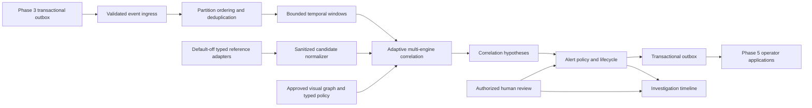

# Phase 4 Intelligence Architecture

Status: proposed architecture; planning only.

## Architectural Rule

Separate facts, hypotheses, policies, workflow state, and human decisions. The
correlation data plane may propose relationships and alerts, but only the
control plane may activate approved rule versions and only authorized users may
make review decisions.



## Trust Boundaries

| Boundary | Rule |
| --- | --- |
| Phase 3 ingress | Accept allowlisted event type and major version only; reject malformed, oversized, prohibited, or cross-department payloads |
| Time and geometry | Preserve declared clocks and coordinate systems; reject ambiguous time, invalid geometry, and unauthorized transforms |
| Rule activation | Compile, type-check, cost-check, version, approve, and hash before workers can evaluate a rule |
| Reference provider | Resolve secrets per attempt; exact destinations and fields; no credential or raw-response persistence |
| Correlation | Bounded windows and state; hypotheses retain all contributing event IDs and contradicting evidence |
| Alert lifecycle | Deterministic deduplication and state machine; no direct enforcement action |
| Human decision | RBAC, department scope, reason, policy version, actor, timestamp, and immutable audit |
| Phase 5 output | Sanitized operator contracts; no credentials, source URLs, unrestricted external records, or runtime internals |

## Control Plane

The control plane owns:

- immutable rule definitions and versions;
- visual rule documents and canonical typed ASTs;
- constrained CEL checked expressions and environment versions;
- draft, validated, approved, shadow, active, suspended, and retired rule states;
- correlation windows, lateness, cardinality, and resource ceilings;
- alert routing, severity, priority, suppression, escalation, and service-level
  policies;
- reference-provider definitions, secret references, field policies, network
  rules, enablement, and revocation;
- reviewer roles, queues, dispositions, and separation-of-duty policy where
  required;
- retention classes, legal/administrative holds, deletion, and export policy;
- kill switches at platform, department, provider, rule, and alert-policy level;
- immutable revision history, ETags, reason-required mutations, and outbox
  events.

Configuration requests never synchronously contact a reference provider or run
correlation over historical data. Activation fails closed if any policy,
dependency, schema, secret, destination, retention, or authorization gate is
missing.

## Data Plane

1. Consume at-least-once Phase 3 events and validate the existing H-CAM
   envelope plus the declared payload schema.
2. Deduplicate by immutable event ID and record a sanitized duplicate outcome.
3. Partition by department and declared rule key. Preserve stream-local order;
   never infer a global order that the producer did not provide.
4. Place events into bounded event-time windows with an explicit watermark and
   lateness policy.
5. Evaluate approved typed temporal nodes and constrained stateless CEL
   predicates.
6. Resolve permitted reference candidates only through an enabled provider
   adapter and only when the rule and purpose allow that lookup.
7. Produce a canonical hypothesis with positive evidence, contradicting
   evidence, missing evidence, uncertainty, freshness, and lineage.
8. Evaluate the approved alert policy, create or update one deterministic alert
   aggregate, and write the outbox row in the same transaction.
9. Append lifecycle and reviewer events without rewriting prior evidence.
10. Shed, degrade, pause, or dead-letter work under bounded policy rather than
    accumulating unbounded latency.

## Time And Ordering Contract

Every ingested or derived record keeps distinct temporal fields:

- `occurred_at`: when the represented real-world or generated event occurred;
- `observed_at`: when the producer formed the observation;
- `received_at`: when H-CAM accepted the envelope;
- `recorded_at`: when the durable H-CAM revision committed;
- `corrected_at`: when a later correction became effective, when applicable.

All values include UTC offset or are normalized to UTC while retaining source
timezone and clock-confidence metadata. Event-time windows use `occurred_at` and
an explicit watermark. Receive or record time may drive operational latency but
cannot rewrite event order. Missing, conflicting, future-skewed, or implausibly
old time remains an explicit degraded state. Replay binds the original event,
rule, policy, clock, and window versions so a later rule change cannot silently
alter historical results.

## Spatial Contract

PostGIS owns canonical stored geometry with declared SRID, validity checks,
bounded vertex and extent limits, and explicit transforms. External API geometry
uses RFC 7946 GeoJSON in WGS84 longitude/latitude order. Internal projected
geometry may be used for approved distance calculations but must be transformed
through an allowlisted SRID and recorded transform version.

Camera adjacency, administrative areas, routes, and geofences are versioned
configuration entities. Invalid rings, mixed or absent SRIDs, antimeridian
ambiguity, excessive precision, unexpected altitude, and out-of-policy areas
fail closed. Spatial feasibility can support a cross-camera hypothesis, but it
cannot establish identity.

## Correlation Model

The selected architecture is Adaptive Multi-Engine Correlation (`AMEC`). Its
mandatory core is deterministic and evidence driven. Optional probabilistic,
temporal-graph learned, or ensemble lanes may propose, fuse, or rank candidates,
but they cannot bypass required facts, convert a hypothesis into identity, hide
their feature/model lineage, or suppress disagreement and missing evidence.

AMEC supports deterministic CPU, hybrid ranked, model-first shadow,
uncertainty-ensemble, and cross-engine research modes. Capability-aware
placement can add lanes on GPU or Kubernetes hardware without changing event,
hypothesis, alert, provenance, or human-authority semantics. Exact lane design,
research basis, promotion, and evaluation are specified in
[Adaptive Multi-Engine Correlation Research](adaptive-correlation-research.md).

### Correlation Inputs

- event type and immutable event ID;
- department, camera, stream, assignment, and tracker epoch;
- event time, source sequence, receive time, and clock confidence;
- object class and approved non-sensitive attributes;
- geometry/rule/pipeline/model lineage;
- optional generated ANPR alternatives with confidence and review state;
- authorized, normalized reference candidates with source, version, freshness,
  and policy scope.

### Correlation Keys

Keys must be explicit and typed. Examples include exact event scope, camera
group, approved location relation, time interval, class, direction, and a
normalized generated reference token. A local track key cannot cross cameras
or tracker epochs. Camera adjacency is configuration, not proof that two tracks
represent the same entity.

### Hypothesis Contract

A hypothesis should include:

- opaque hypothesis ID and deterministic correlation key;
- rule, graph, policy, and engine versions;
- department and bounded scope;
- window start/end, watermark, and completeness state;
- contributing and contradicting event references;
- candidate reference IDs that reveal no provider secret or unrestricted data;
- confidence/calibration method and explicit uncertainty;
- active, unavailable, and degraded lanes; arbitration mode; per-lane typed
  result; calibration population; contradiction and disagreement vectors;
- missing, stale, late, or degraded inputs;
- status: `open`, `superseded`, `expired`, or `retracted`;
- `identity_state: not_established` by default;
- retention class and immutable provenance digest.

## Provenance Contract

The H-CAM evidence graph adopts the useful W3C PROV concepts without claiming
PROV conformance:

- entities are immutable event, rule, policy, provider-candidate, hypothesis,
  alert-revision, timeline-entry, and export-manifest versions;
- activities are validation, correlation, lookup, review, correction, retention,
  deletion, and export operations;
- agents are attributable users, services, model/runtime versions, and approved
  organizations acting in declared roles;
- derivations connect each output version to exact input versions and the
  activity that produced it.

Each provenance edge is typed, scoped to a department, ordered where meaningful,
and integrity-bound. Provenance references are not authorization grants: every
read still passes purpose, role, scope, retention, and hold policy. Corrections
create new entities and derivations rather than mutating the source chain.

## Rule System

Reuse the Phase 3.4 decision: visual rule graph plus typed temporal nodes plus
constrained CEL.

Typed nodes own stateful operations such as:

- `all`, `any`, `not`, and threshold quorum;
- `sequence`, `within`, `for_at_least`, `until`, and bounded absence;
- count, rate, distinct-stream count, and bounded aggregation;
- deduplication, cooldown, suppression, and repeat limits;
- approved location relation and schedule gates;
- reference-candidate requested, received, stale, unavailable, and reviewed;
- proposed-alert creation and routing intent.

CEL is limited to stateless predicates over a closed typed context. It has no
network, filesystem, SQL, secrets, dynamic code, camera control, notification,
dispatch, identity assertion, or enforcement functions. Expressions are parsed
and type-checked on the configuration path, stored as canonical checked ASTs,
and evaluated only from approved versions.

Rule versions move through `draft`, `validated`, `approved`, `shadow`, `active`,
`suspended`, and `retired`. Shadow evaluation consumes the same generated input
and records bounded comparison evidence but cannot create an operational alert,
contact a provider outside its separately authorized test mode, or affect
routing. Activation requires a policy-defined shadow result or an attributable
waiver; rollback activates a prior immutable version rather than editing it.

## Alert Aggregate And Lifecycle

```text
candidate
   |
   v
pending_review --> acknowledged --> investigating --> resolved --> closed
       |                |                |               |
       +--> suppressed  +--> escalated   +--> merged     +--> reopened
       |
       +--> dismissed
```

The exact state machine must define allowed actor roles, required reasons,
optimistic-concurrency version, deadlines, and emitted events for every
transition. `priority`, `severity`, `confidence`, and `review disposition` are
different fields and must never be collapsed into one score.

The alert deduplication key should hash department, policy version, correlation
key, bounded time bucket or active incident key, and routing scope. Replayed or
redelivered inputs cannot create a second alert. Materially changed evidence
appends a revision and may reprioritize only according to the approved policy.

No lifecycle state authorizes physical action. Dispatch integration is outside
the Tier A scope and requires a later separately governed contract.

The selected authority architecture supports three non-interchangeable classes:

- `mandatory_review` for all police-intelligence proposed alerts in the Phase 4
  baseline;
- `bounded_automation` for generated tests and separately approved
  low-consequence system-health routing, suppression, and recovery only;
- `future_autonomous_action` as a reserved contract boundary that is absent or
  hard-disabled until a separate legal, safety, operational, integration, and
  owner authorization program completes.

Alert class is policy-owned, immutable per revision, and cannot be changed to
bypass human review. No lower-priority intelligence alert inherits system-health
automation.

Alert policy also defines per-rule, department, routing-queue, and system-wide
volume budgets. Deterministic incident-level collapse groups repeated proposals
without losing revisions. When a budget is exhausted, the system records an
overload state, preserves counts and representative evidence, and escalates
system health; it does not silently discard alerts or weaken human review.

## Reference Integration Architecture

All integrations implement a typed provider interface:

```text
authorize purpose -> resolve credential -> validate exact destination
-> send bounded request -> validate bounded response -> normalize candidate
-> discard raw transport material -> emit sanitized audit and health result
```

Required properties:

- default off and denied in production until provider-specific approval;
- exact HTTPS scheme, host, port, path family, certificate policy, and private
  CA reference where needed;
- no redirects, environment proxies, URL credentials, wildcard destinations,
  or user-supplied arbitrary queries;
- typed secret provider with rotation on each attempt and no database secret;
- strict request/response schemas, size limits, deadlines, concurrency limits,
  circuit breakers, and revocation;
- field minimization and normalized opaque references rather than raw records;
- freshness, source version, reason, requester, and outcome audit;
- partial, stale, unavailable, unauthorized, rate-limited, and malformed states;
- no automatic confirmation from a single candidate or fuzzy similarity score.

The first adapter may only be an in-process generated provider. The generic
transport envelope may be contract-tested against local generated simulators,
but remains disabled and cannot accept arbitrary runtime destinations or
schemas. No real provider integration is selected now. A future external
provider is not a drop-in configuration change; it is a new governed
integration milestone.

## Persistence

The proposed PostgreSQL/PostGIS design is additive:

| Store | Purpose | Key controls |
| --- | --- | --- |
| `intelligence_rules` | Immutable visual/AST/CEL rule versions | Closed schema, digest, approval, lifecycle |
| `correlation_runs` | Bounded execution window and replay boundary | Scope, watermark, status, lease, reason |
| `correlation_hypotheses` | Canonical hypotheses and provenance | Deterministic key, uncertainty, no identity assertion |
| `hypothesis_evidence_refs` | Positive, contradicting, missing, and stale references | Opaque source IDs, role, digest, ordering |
| `reference_providers` | Provider metadata and enablement | No credentials, exact policy and destination references |
| `reference_queries` | Sanitized request lifecycle | Purpose, requester, safe outcome, no raw response |
| `alerts` | Current alert aggregate | Unique dedupe key, optimistic version, department scope |
| `alert_revisions` | Append-only alert changes | Prior/new state, reason, actor, policy |
| `investigation_timelines` | Case-neutral timeline container | Department scope and status |
| `timeline_entries` | Facts, hypotheses, reviews, actions, corrections | Append-only, typed, immutable provenance |
| existing outbox | Durable domain-event publication | Same transaction as aggregate mutation |
| existing audit log | Security and administrative audit | Separate from investigation evidence |

PostGIS is used for approved camera/location relationships and administrative
spatial filtering, not to infer physical identity from image coordinates.
Every department-scoped table uses application authorization plus PostgreSQL row
security as defense in depth. Runtime roles must not be superusers, table owners,
or hold `BYPASSRLS`; policies are forced where supported and tested with direct
cross-department queries. Administrative maintenance uses a separate audited
role and cannot be reached through product APIs.

Mutable aggregates record both effective/event chronology and system revision
chronology. Append-only revisions retain the exact predecessor, source versions,
activity, actor/service, policy, transaction, and integrity digest. A later
correction never changes the bytes used by an earlier decision.
Queue workers may use PostgreSQL `FOR UPDATE SKIP LOCKED` only for queue-like
claiming; it is not a general consistency mechanism.

## API Surface

Planned API families:

- `/intelligence-rules` for draft, validate, approve, activate, suspend, and
  retire, including shadow comparison and rollback evidence;
- `/correlation-hypotheses` for scoped read, explanation, and replay evidence;
- `/alerts` for list, read, assign, acknowledge, escalate, suppress, resolve,
  close, reopen, dismiss, and merge;
- `/reference-providers` for metadata, health, enablement, revocation, and
  generated test operations;
- `/investigation-timelines` for append-only entries and controlled evidence
  references;
- `/intelligence-health` for queue, freshness, degradation, and kill-switch
  state.

GIS request and response geometries use one versioned GeoJSON profile with
declared size, feature-count, geometry-type, coordinate, precision, and extent
bounds. Raw SQL, arbitrary spatial-reference definitions, and user-controlled
coordinate transformations are never API inputs.

All mutations require department scope, an exact permission, `If-Match` where
state is mutable, and `X-HCAM-Reason`. Sensitive reads use no-store responses
and purpose-bound access audit. APIs return bounded reason codes, not provider
payloads, SQL details, stack traces, paths, or credentials.

## Delivery And Concurrency

- Input and output delivery are at least once; domain effects are idempotent.
- A deterministic event ID and aggregate unique constraint own deduplication.
- Each alert transition and its outbox event commit atomically.
- A correction or retraction creates idempotent downstream revision work for
  every affected hypothesis, alert, timeline, export, and search projection.
- Workers use bounded leases, heartbeats, abandoned-work recovery, and retry
  classes.
- Authorization, policy, schema, integrity, and destination failures do not
  retry automatically.
- Transient timeouts and provider unavailability retry with bounded jitter and
  circuit breaking.
- SQLite remains a single-worker development boundary. PostgreSQL is required
  for concurrent worker evidence.

## Observability

Low-cardinality metrics cover ingress outcomes, window lag, queue depth,
hypothesis outcomes, alert transitions, suppression, time to acknowledge,
staleness, provider outcomes, retries, circuit state, dead letters, and kill
switches. Camera, stream, alert, person, plate, provider record, user, locator,
and secret identifiers are forbidden as metric labels.

Traces cover operations with duration. Named events cover lifecycle points.
Operational logs, security logs, audit trails, and investigation evidence are
separate records with separate retention and access policy.

## Failure And Degradation

The engine exposes `healthy`, `degraded`, `paused`, `blocked`, and `failed`.
Under pressure it first disables optional enrichment, then narrows approved
windows, sheds low-priority generated work, pauses provider lookups, and
finally stops rule evaluation. It never silently drops a required event or
continues with stale reference data as if fresh.

Alert overload is handled separately from correlation-resource pressure. The
system applies approved deterministic collapse and suppression budgets, exposes
the number and class of affected proposals, and stops new operational proposals
when safe review capacity is unavailable. It never auto-confirms an alert to
reduce backlog.

Provider outage, stale data, clock uncertainty, event gaps, failed ordering,
policy mismatch, and partial evidence must remain visible on the hypothesis and
alert. A fail-closed component cannot be bypassed by the operator dashboard.

## Deployment Shapes

The architecture must support local CPU development, owned GPU labs, standalone
servers, and Kubernetes workers through existing Phase -1 capability profiles.
Phase 4 planning does not activate any profile. Scaling changes placement and
throughput, not contract meaning, authorization, retention, or review rules.
