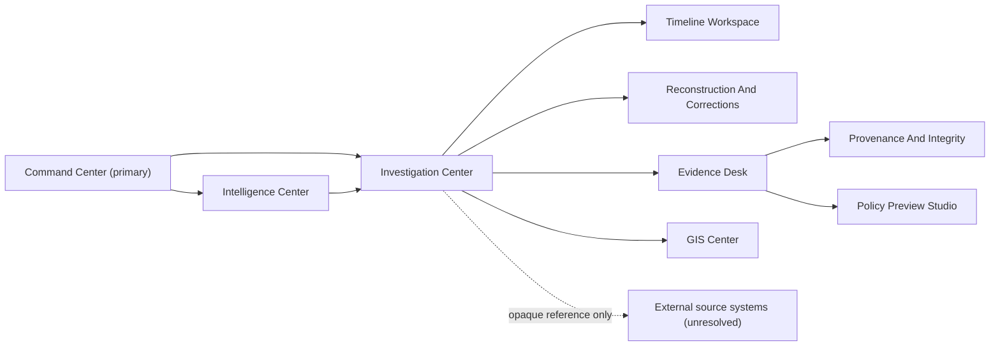

# P5.5 Investigation And Evidence Architecture

Status date: 2026-09-09

Status: planning complete; owner decisions and implementation remain pending

## Purpose

P5.5 gives authorized operators a deterministic way to understand what H-CAM
recorded, inferred, reviewed, corrected, and referenced over time. It does not
turn H-CAM into a source-media repository, court evidence system, legal-policy
engine, or case-management authority.

The primary design objective is reconstructability without overclaim:

> Show the exact record, revision, source reference, provenance, integrity
> observation, uncertainty, correction history, and limitation without calling
> any of them proof, identity, guilt, authenticity, or admissibility.

## Inherited Foundation

P5.5 consumes rather than replaces:

- Phase 4.5 `InvestigationTimelineV2`, `TimelineEntryV2`, reconstruction,
  evidence-reference, integrity, provenance, correction-impact, review,
  relationship, retention, hold, deletion-receipt, export-manifest, case-bridge,
  and PROV-projection contracts;
- Phase 4.7 HTTP/event/workflow handoff contracts;
- P5.1 shell, session, capability, query, event-invalidation, observability,
  localization, accessibility, and dynamic-profile packages;
- P5.2 Command Center and GIS Center handoffs;
- P5.3 view-only camera/live handoffs, without media resolution;
- P5.4 analytical truth separation, proposed-alert review, corrections, and
  authoritative HTTP confirmation.

No P5.5 view may weaken an inherited authorization, bounded-query, no-store,
generated-only, or non-operational rule.

## Portal Topology

Command Center remains the primary operational landing page. Investigation
Center is a connected specialist portal. Evidence Desk is a separate route and
authorization domain inside that portal so timeline access does not imply
evidence access.

Suggested routes:

| Route | Purpose | Default authority |
| --- | --- | --- |
| `/investigations` | Workload, saved bounded views, freshness, gaps | investigation reader |
| `/investigations/:id` | Summary, current revision, chronology | investigation reader |
| `/investigations/:id/timeline` | Authoritative paginated entry table | investigation reader |
| `/investigations/:id/reconstruct` | Exact-revision reconstruction and comparison | reconstruction reader |
| `/investigations/:id/corrections` | Corrections, retractions, impacts, stale dependencies | correction reader |
| `/investigations/:id/relationships` | Merge, alias, reopen, related timelines | relationship reader |
| `/evidence` | Scoped evidence-reference inventory | evidence reader |
| `/evidence/:id` | Identity, source assertion, availability, limitations | evidence reader |
| `/evidence/:id/integrity` | Append-only assessment history | integrity reader |
| `/evidence/:id/provenance` | Bounded graph and authoritative tables | provenance reader |
| `/investigations/:id/policy-previews` | Generated retention/hold/deletion/export previews | policy-preview reader |

## Semantic Truth Model

The interface preserves these orthogonal concepts:

| Concept | Meaning | Must not imply |
| --- | --- | --- |
| Timeline entry | Immutable H-CAM record at a sequence | event occurred as asserted |
| Temporal assertion | Claimed event time with source/precision | trusted causal order |
| Evidence reference | Opaque identity for external material | content was fetched or verified |
| Availability | Last observation of source reachability | content integrity |
| Integrity assessment | Algorithm/profile/result at one time | authenticity or admissibility |
| Provenance | Recorded entity/activity/agent relations | factual correctness |
| Custody event | Supplied transfer/handling assertion | complete physical custody |
| Correction | New record changing interpretation | deletion of prior record |
| Retraction | New assertion withdrawing reliance | erasure of history |
| Review | Attributable human decision | identity, guilt, or external action |
| Policy preview | Non-operative generated projection | legal authority or execution |

The UI uses full labels and definitions. Colors and icons are secondary cues.

## Timeline And Ordering

Each entry exposes:

- immutable entry ID and timeline ID;
- aggregate revision and monotonic record sequence;
- entry family and subtype;
- trusted record/receive time;
- asserted event time, source, precision, uncertainty, and clock state;
- actor or service attribution and role;
- references, relationships, supersession, correction, and retraction state;
- freshness, completeness, and producer limitations.

Default order is record sequence. Event-time order is an explicit alternative
view and can contain ties, unknown times, ranges, and disagreement. It never
rewrites sequence or creates a causal edge.

Large timelines use server-bounded pages. A visual timeline lane may window
already fetched rows, but the semantic table/list, page boundaries, focus
anchor, row count, and reading order remain authoritative.

## Exact-Revision Reconstruction

A reconstruction request binds:

- timeline ID and exact through-revision;
- record-sequence or event-time view;
- current authorization and purpose;
- expected contract version and query bounds.

The result shows:

- manifest ID, reconstruction digest, generated time, and contract version;
- included immutable entry versions in deterministic order;
- prior and reconstructed aggregate state;
- later corrections and retractions excluded by the selected revision;
- missing, unavailable, inconsistent, or policy-denied components;
- producer and environment limitations.

Before/after comparison uses field-level typed changes. It never generates a
free-form AI explanation. The narrative summary is deterministic and secondary
to exact tables.

## Correction And Retraction Propagation

Corrections and retractions are append-only commands. The workspace shows:

1. original entry and exact version;
2. correcting/retracting entry and authority;
3. typed reason and effective revision;
4. impact closure over hypotheses, alerts, reviews, evidence references,
   relationships, exports, and derived views;
5. per-target pending, applied, blocked, failed, or superseded result;
6. unresolved impacts that make downstream views stale or incomplete.

No client automatically reverses reviews or external actions. Impact events
invalidate scoped queries; authoritative HTTP reads determine current state.

## Evidence Reference Workspace

The Evidence Desk displays only field-minimized metadata:

- opaque reference ID, timeline role, department, and source class;
- immutable source-version assertion, expected size/digest/profile when
  supplied, and registration time;
- current availability observation and history summary;
- integrity-assessment history;
- provenance/custody completeness and limitations;
- correction, retraction, retention, hold, deletion-receipt, and export-preview
  relationships;
- explicit `source_not_resolved` and `media_not_rendered` status.

Locators, paths, URLs, credentials, raw identifiers, media, documents, and
payload bodies are absent from list rows, navigation state, logs, metrics, and
generated fixtures.

## Integrity State Matrix

One aggregate badge is prohibited. The detail page uses separate rows:

| Dimension | Example states |
| --- | --- |
| Reference identity | registered, superseded, retracted |
| Availability | unknown, observed-available, unavailable, access-denied |
| Digest observation | not-assessed, match, mismatch, unsupported-profile |
| Provenance closure | complete, partial, inconsistent, unavailable |
| Custody history | supplied, gap-present, unknown, external |
| Signature/timestamp | absent, observed, unverified, invalid, unsupported |
| Legal assessment | not-performed |

Every state includes observed time, source, method/profile, assessor class,
scope, and limitation. `match` means only that the assessed bytes matched the
named expected digest under the named profile at that observation.

## Provenance And Relationship Views

The graph renderer consumes a server-bounded projection and has no mutation
authority. It supports entity, activity, and agent nodes plus typed derivation,
generation, use, attribution, association, correction, retraction, and
relationship edges from the accepted contract.

The authoritative alternative is two tables:

- nodes: ID, type, version, label, state, source, limitations;
- edges: source, relation, target, activity/time, authority, limitations.

Unknown endpoints, cycles, excess depth/fanout, cross-scope edges, and partial
closure fail closed or appear as explicit bounded errors. A generated PROV
projection is downloadable only as an in-memory test fixture during a separately
authorized implementation; P5.5 planning adds no export action.

## Policy Preview Studio

The Policy Preview Studio is deliberately non-operative. It can present
generated projections for:

- retention evaluation against an opaque policy reference;
- exact-target hold overlay and release preview;
- deletion intent and per-target simulated outcome/residual state;
- purpose-bound reference-only export manifest preview;
- disposition and review requirements.

Every page carries `generated_only`, `preview_only`, `execution_unavailable`,
and policy/authority limitations. There is no Run, Delete, Export, Download,
Print, Hold, Release, Approve, Send, or Sign command.

## Case-Management Bridge

The bridge remains a typed disabled capability. The UI may show:

- bridge status `disabled`;
- required contract and authorization gaps;
- unsupported operations;
- no destination, credential, case identifier, or action control.

No external case-system integration is planned or implied.

## Server Authority And Client State

Reads are department, role, purpose, and capability scoped. Sensitive responses
use `Cache-Control: no-store`. Mutations, if separately authorized later, use:

- strong ETag and `If-Match`;
- expected aggregate revision or target digest;
- semantic command identity and delivery identity;
- `X-HCAM-Reason` equivalent;
- bounded in-memory draft and explicit confirmation;
- server-issued attributable receipt.

Events are scoped invalidation hints only. After an event, the client fetches
the authoritative resource. Logout, department change, role loss, capability
revocation, or purpose change clears sensitive caches and drafts immediately.

## Dynamic Resource Profiles

All profiles retain the same routes, records, permissions, semantics, and
accessibility:

| Profile | Rendering policy |
| --- | --- |
| Low resource | paginated tables, no graph animation, bounded single comparison |
| Enhanced workstation | wider tables, local visual lane, bounded graph, parallel prefetched pages |
| Control room | coordinated detail and timeline windows, no additional authority |
| GPU lab | higher visual density only; no model or inference use |
| Future server | larger server-approved pages/closures only within contract bounds |

Automatic profile selection can reduce visual cost but cannot hide records,
skip limitations, widen queries, or change operator authority.

## Accessibility Architecture

- native headings, landmarks, tables, lists, links, buttons, dialogs, and form
  controls are the baseline;
- the timeline preserves DOM, reading, focus, and record-sequence order;
- paginated navigation announces page, result count, filters, and freshness;
- correction and comparison views identify additions, removals, and changes in
  text, not color alone;
- graph and visual timeline views have complete table alternatives;
- focus survives refresh through stable entry IDs and returns to a sensible
  control after conflicts or closed dialogs;
- all consequential previews require review of scope and limitations even
  though execution remains unavailable;
- localized visible text never changes canonical IDs, reason codes, or digests.

## Observability Boundary

Allowed client signals are low-cardinality operation, surface, outcome,
freshness class, profile, and sanitized failure family. Prohibited labels and
payloads include timeline/evidence IDs, locators, actors, departments, purposes,
case text, reasons, digests, filenames, and user-entered data.

Audit, security, operational, investigation, custody, and evidence records are
separate. Client telemetry cannot create or modify any of them.

## Planning Boundary

This architecture authorizes no product code, route, migration, dependency,
runtime, source resolution, media rendering, evidence access, legal policy,
hold, deletion, export, provider, network, model, operational action,
container, deployment, or remote Git operation.
